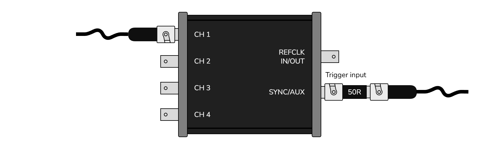
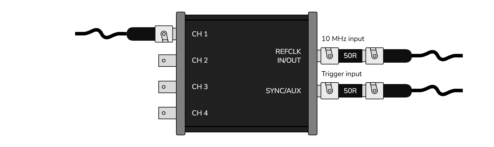
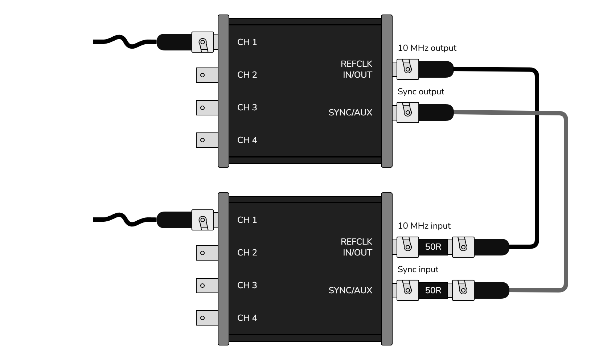

# Setups

## Standalone

Basic setup, up to 4 channels.

## Lab reference clock

10 MHz reference clock (3.3V, square, 50Ω at source) from lab distribution amplifier.

## External trigger source

External device generating trigger pulses (3.3V, square, 50Ω at source). [not yet supported]

## External trigger source and reference clock

External device generating trigger pulses (3.3V, square, 50Ω at source) & 10 MHz reference clock (3.3V, square, 50Ω at source). [not yet supported]

## 2 unit sync

Two ThunderScopes on the same PC, up to 8 channels. [not yet supported]

