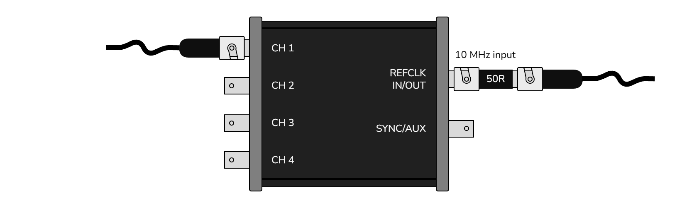
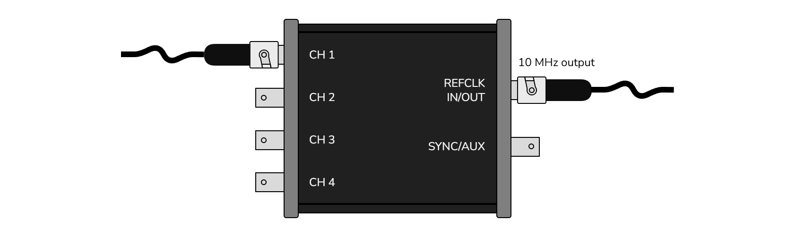

# Setups

## Standalone

Standalone setup, up to 4 channels.

## Reference clock input

10 MHz reference clock (3.3V, square, 50Ω at source) input from external device or lab distribution amplifier.

## Reference clock output

10 MHz reference clock (3.3V, square, 50Ω at source) output.

## External trigger input

External device generating trigger pulses (3.3V, square, 50Ω at source). [not yet supported]

## External trigger input and reference clock input

External device generating trigger pulses (3.3V, square, 50Ω at source) & 10 MHz reference clock (3.3V, square, 50Ω at source). [not yet supported]

## Two unit sync

Two units on the same PC, up to 8 channels. [not yet supported]

